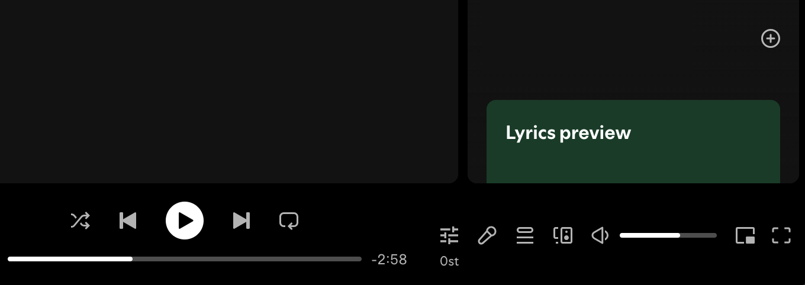
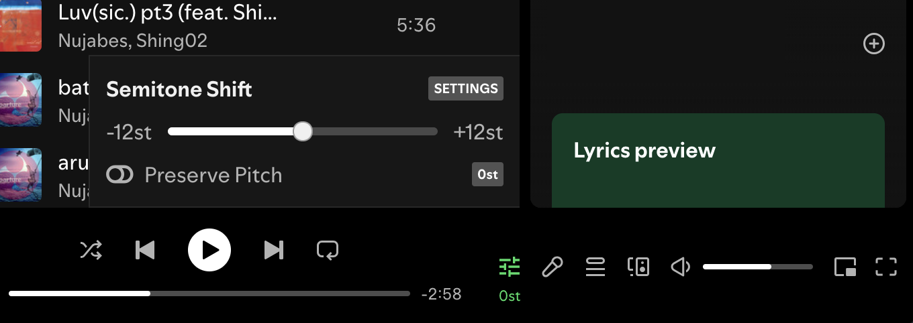
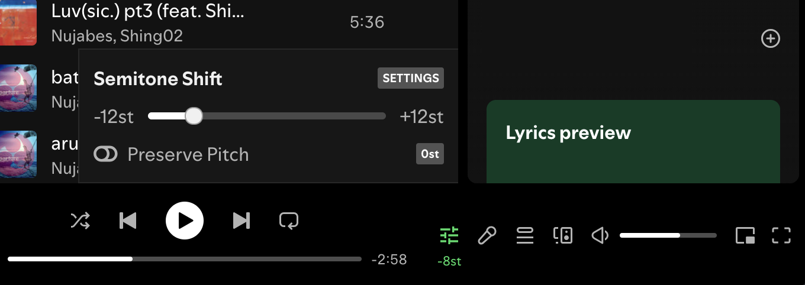
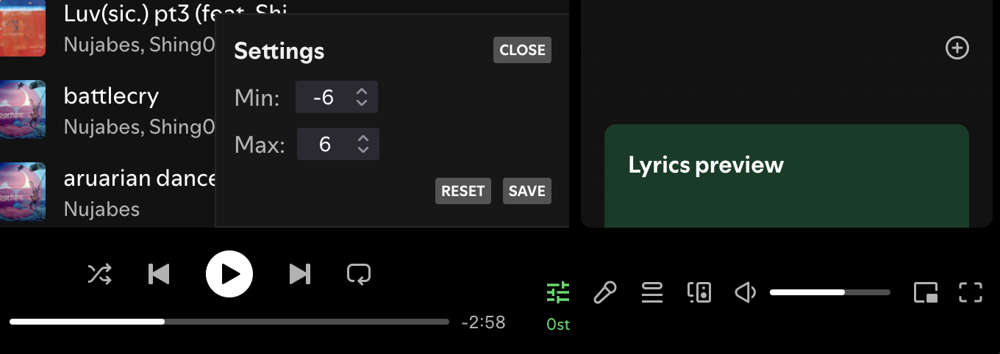
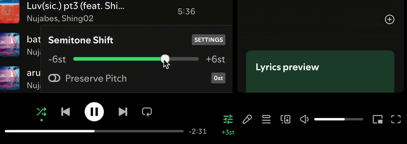

	<picture>
		<source media="(prefers-color-scheme: dark)" srcset="assets/banner_dark.png" />
		
	</picture>

#### Added to firefox store Aug 7, 2026.

## Screenshots

| Hotbar Icon | General UI |
| --- | --- |
|  |  |

| Shift Down | Shift Up |
| --- | --- |
|  |  |

| Settings | Slider Gif                                    |
| --- |-----------------------------------------------|
|  |  |

## Feature highlights

Browser extension for Spotify Web Player that adds a playback control beside Spotify’s volume controls.
- Changes playback speed using whole semitone steps instead of decimal speed/percentage values.
- Default range is -12st to +12st:
    - -12st = half speed / one octave down
    - 0st = normal speed
    - +12st = double speed / one octave up
     
- Includes a reset button to return to 0st.
- Lets users customize the min/max semitone range in settings.                      
- Includes a Preserve Pitch toggle.                                                 
- Saves semitone, pitch, and range settings in browser localStorage.             
- Works by injecting controls into Spotify Web Player and applying the converted playback rate to Spotify’s media elements.

## Quick start

#### Extensions/Add-ons coming soon.

## Contributing

If you've found a bug or have a feature request, please [create an issue](https://github.com/matteogristina/spotify-pitch-shift/issues/new) and we can discuss it there.
## Acknowledgments & Credits

This project is a standalone fork/customization of [the original spotify playback speed extension](https://github.com/rnikko/spotify-playback-speed) created by [@rnikko](https://github.com/rnikko). 

* **Key Changes:** Pivoted from percentage-based playback speed control into a semitone-based control. It is not intended as a pull request to the original project.

Again, huge thanks to [@rnikko](https://github.com/rnikko) for building the foundation!